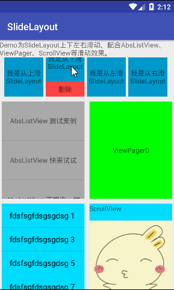

# SlideLayout

纯手工超级迷你轻量级全方向完美滑动处理侧滑控件（比官方 support v4 包 SlidingPaneLayout 控件更加 Q 迷你，累计代码不足 300 行），支持上下左右有各种侧拉，可配置侧拉松手临界距离，支持单独使用、ListView、GridView、RecycleView、ScrollView、ViewPager 等各种嵌套（作为 item 使用或者作为以上所有控件的父容器使用），具体不同配置展示效果如下图。

<div></div>

# 说明文档

如下是关于 SlideLayout 的相关使用方式、属性说明、拓展自定义的解释说明。

### 使用样例

实现类似手机 QQ 侧滑效果，ListView 向右侧滑拉出侧边栏。
```xml
<cn.yan.library.SlideLayout
    android:layout_width="match_parent"
    android:layout_height="match_parent"
    app:slideDirection="fromLeft"
    app:slideCriticalValue="50dp">
    <ListView
        android:layout_width="match_parent"
        android:layout_height="match_parent"
        android:entries="@array/demo_array"/>

    <TextView
        android:background="@android:color/holo_red_light"
        android:layout_width="100dp"
        android:layout_height="match_parent"
        android:text="我是侧滑区域"/>
</cn.yan.library.SlideLayout>
```

实现类似手机 QQ ListView 聊天列表任意 item 向左滑动呼出删除按钮效果。
```xml
<cn.yan.library.SlideLayout
    android:layout_width="match_parent"
    android:layout_height="80dp">
    <TextView
        android:id="@+id/content_id"
        android:gravity="center"
        android:layout_width="match_parent"
        android:layout_height="match_parent"/>

    <LinearLayout
        android:layout_width="200dp"
        android:layout_height="match_parent"
        android:orientation="horizontal">
        <TextView
            android:id="@+id/slide_id"
            android:background="@android:color/holo_blue_dark"
            android:layout_width="100dp"
            android:layout_height="match_parent"
            android:text="删除"/>

        <TextView
            android:id="@+id/slide1_id"
            android:background="@android:color/holo_green_dark"
            android:layout_width="100dp"
            android:layout_height="match_parent"
            android:text="收藏"/>
    </LinearLayout>
</cn.yan.library.SlideLayout>
```

### 已实现类说明

| 类别 | 类名 | 说明 |
| ----- | ----- | ----- |
| library | SlideLayout | 支持配置各种方向侧滑和各种嵌套或者被嵌套的侧滑控件。 |

### 属性说明

| 属性 | 含义 |
| ----- | ----- |
|app:slideCriticalValue | SlideLayout 任意方向侧滑拉出多大距离后松手敏感距离，譬如侧滑大于 50dp 后松手则自动滑开，小于 50 dp 内松手则自动收起；不设置默认为 SlideLayout 控件第二个子成员 width 的二分之一。|
|app:slideDirection | 侧滑从哪边拉出，默认为从右侧拉出，可取值为 fromRight、fromLeft、fromTop、fromBottom。 |

### SlideLayout 提供方法说明

| 方法 | 说明 |
| ----- | ----- |
| int getSlideState() | 获取当前侧滑控件所处状态，STATE_CLOSE、STATE_SLIDING、STATE_OPEN。 |
| void smoothCloseSlide() | 平滑的收起侧滑。 |
| void smoothOpenSlide() | 平滑的打开侧滑。 |

### SlideLayout 使用注意事项

SlideLayout 控件有且必须包含两个子控件，第一个为 content 布局，默认撑满整个 SlideLayout，第二个为 slide 布局，默认不可见；切记两个子控件所处顺序，子控件层级不限，具体模板如下：

```
<cn.yan.library.SlideLayout
    android:layout_width="match_parent"
    android:layout_height="match_parent">
    <控件一（Content），不限嵌套层级等，默认可见/>

    <控件二（slide），不限嵌套层级等，默认不可见/>
</cn.yan.library.SlideLayout>
```

# License 声明

MIT License

Copyright (c) 2016 yanbo

Permission is hereby granted, free of charge, to any person obtaining a copy
of this software and associated documentation files (the "Software"), to deal
in the Software without restriction, including without limitation the rights
to use, copy, modify, merge, publish, distribute, sublicense, and/or sell
copies of the Software, and to permit persons to whom the Software is
furnished to do so, subject to the following conditions:

The above copyright notice and this permission notice shall be included in all
copies or substantial portions of the Software.

THE SOFTWARE IS PROVIDED "AS IS", WITHOUT WARRANTY OF ANY KIND, EXPRESS OR
IMPLIED, INCLUDING BUT NOT LIMITED TO THE WARRANTIES OF MERCHANTABILITY,
FITNESS FOR A PARTICULAR PURPOSE AND NONINFRINGEMENT. IN NO EVENT SHALL THE
AUTHORS OR COPYRIGHT HOLDERS BE LIABLE FOR ANY CLAIM, DAMAGES OR OTHER
LIABILITY, WHETHER IN AN ACTION OF CONTRACT, TORT OR OTHERWISE, ARISING FROM,
OUT OF OR IN CONNECTION WITH THE SOFTWARE OR THE USE OR OTHER DEALINGS IN THE
SOFTWARE.